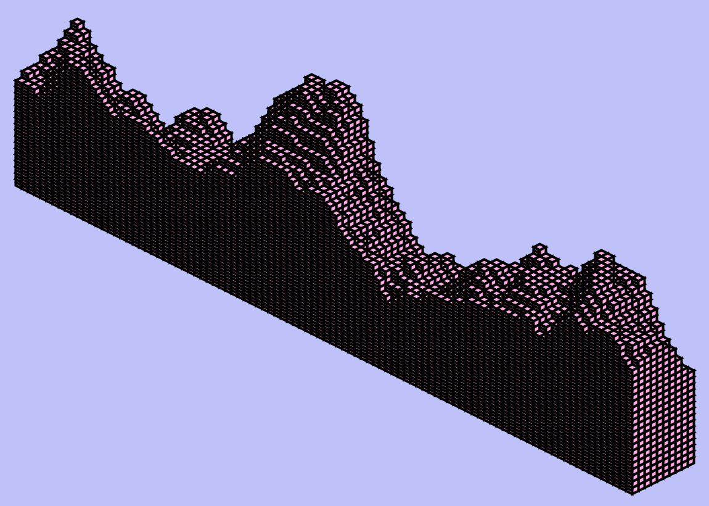
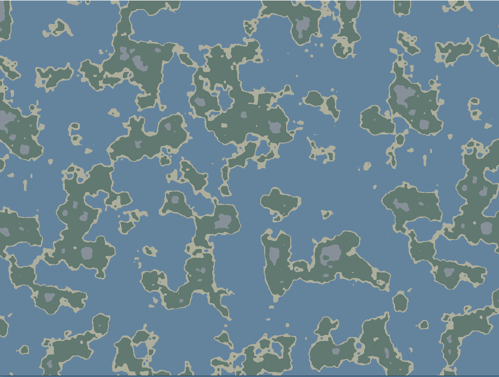

# processing

## Perlin Noise Cubes:  

Followed this tutorial: https://www.youtube.com/watch?v=H7EwbkBWnmA&list=PLs-AKW_j3RDC2KZBkAuSK5P6MHyIkh1g_&index=68  
Made this gif! Pretty cool lookin!  

## Perlin Noise Islands:  

Followed this tutorial: https://www.youtube.com/watch?v=0emj42Bn-_Y&list=PLs-AKW_j3RDC2KZBkAuSK5P6MHyIkh1g_&index=70  
Made something like this:  
  

## SVG Image:  

Used processing to take an SVG and change the colors from black to what they are now. Also combined two of the provinces since it's an old map. Nothing crazy.  

